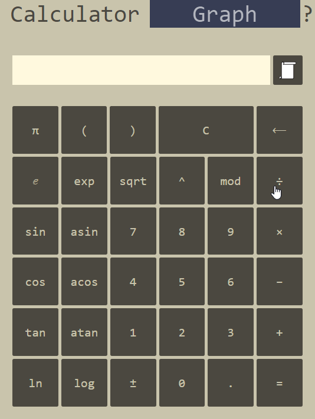
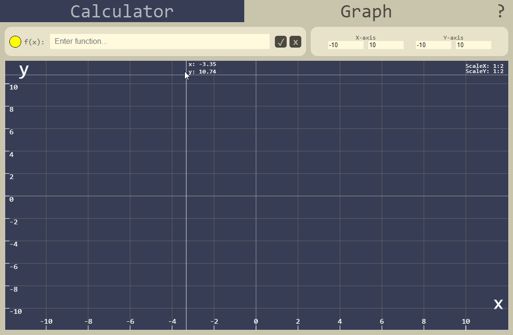

# Calculator

Проект разработанный на языке `python`, целью которого было изучить MVP паттерн. Пользовательский интерфейс был написан на HTML/CSS/JS. Для представления используется библиотека `eel`, которая позволяет связать модель и представление

Реализованны такие функции как: решение произвольных скобочных выражений, история операций, рисование простых графиков функции, с изменением области определения и области значения функции

## Запуск

Установите зависимости

    pip install -r requirements.txt

Запустите проект

    python src/main.py

> [!NOTE]
> Убедитесь что установили виртуальное окружение (`venv`) для `python`

## Примеры

Калькулятор с историей

График функции

